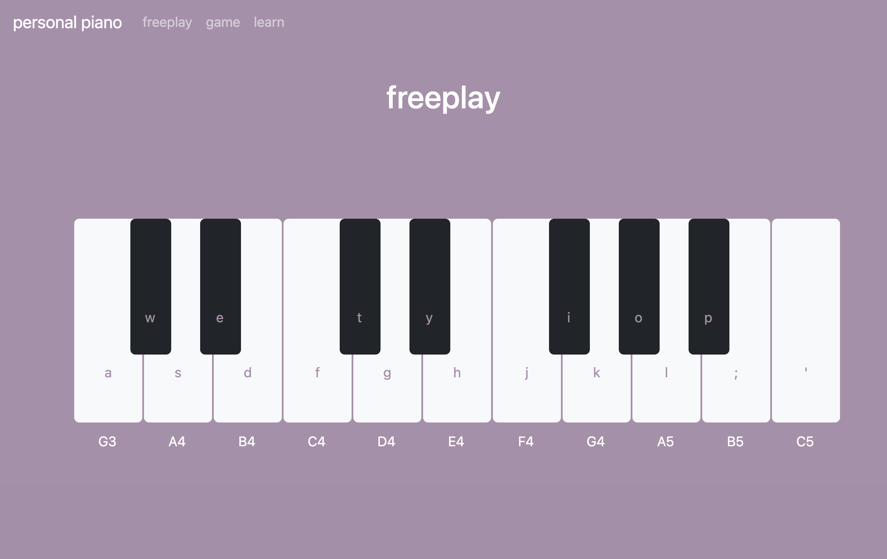

# personal piano

- React app that allows you to play the piano with your keyboard or mouse
- Available at [personal-piano.vercel.app](https://personal-piano.vercel.app/)
- 3 piano modes: freeplay, game, learn

### freeplay mode - play what you like
 

### game mode - repeat the pattern (similar to the Simon game)
 

### learn mode - pick a song and play the highlighted keys
 
